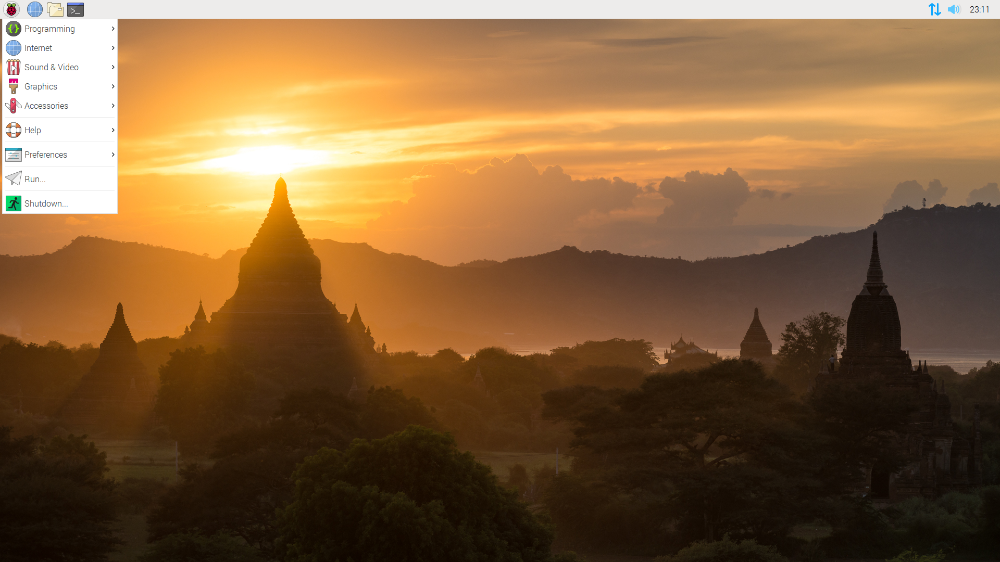
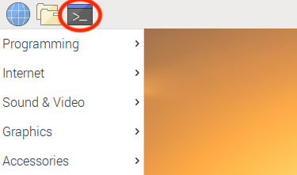
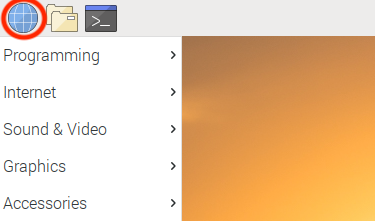

# Manual Cara a Cara

### Instalacion
Breve descripción de los pasos a seguir para instalar el RaspberryPi.


1. Conectar el teclado a alguno de los puertos USB.
2. Conectar el monitor al puerto micro HDMI con su respectivo adaptador.
3. Camara debe estar conectada al puerto 2-lane MIPI CSI camera port.
4. Conectar el cargador al puerto USB-C 5V/3A
5. Prender el monitor.

**Hemos tenido algunos problemas pues el monitor ocupado en la instalacion no es reconocido automáticamente por el RaspberryPI, la solución ha sido seguir los pasos del 1 al 5 pero con un monitor distinto y una vez que aparece el escritorio se sustituye el monitor.**

### Software
Breve descripción de los pasos a seguir para correr Cara a Cara.



1. Abrir terminal, es decir el ícono con una pantalla negra en la esquina superior izquierda.



2. En la terminal escribir los siguientes comandos seguidos de enter:

```bash
cd Instalacion
export FLASK_APP=index.py
flask run
  ```
3. Abrir el explorador e ingresar el url que apareció hasta el final del paso 2.
`127...`.



4. Hacer pantalla completa con fn+f11.


### Posibles casos de quiebre.

En caso de que la aplicación presentara un error seguir los siquientes pasos:

1. Salir de modo pantalla completa con fn+f11 o escape.

2. En la terminal oprimir 'ctrl+c'.

3. Escribir
```bash
flask run
```
4. Seguir la seccion de **Software** a partir del paso 3(abrir navegador, ingresar url, hacer pantalla grande).
